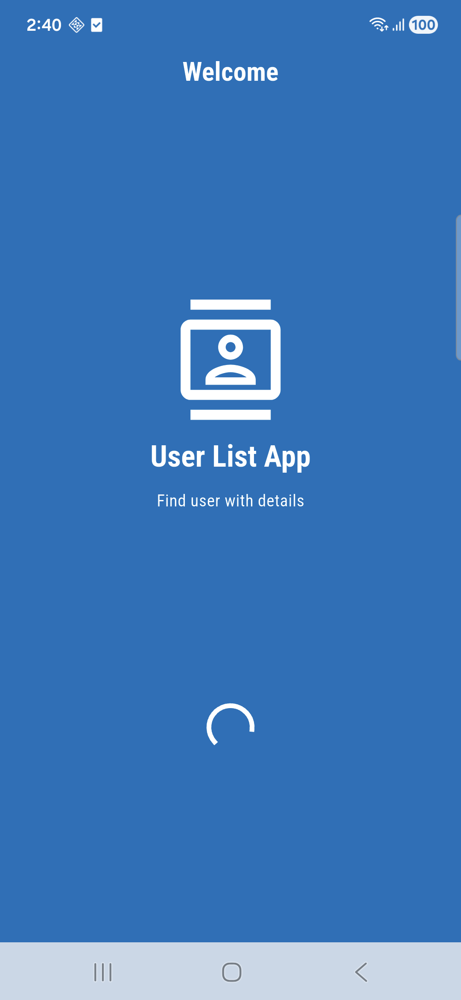
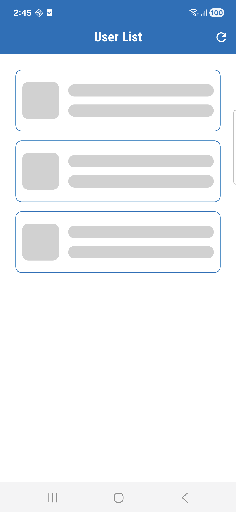
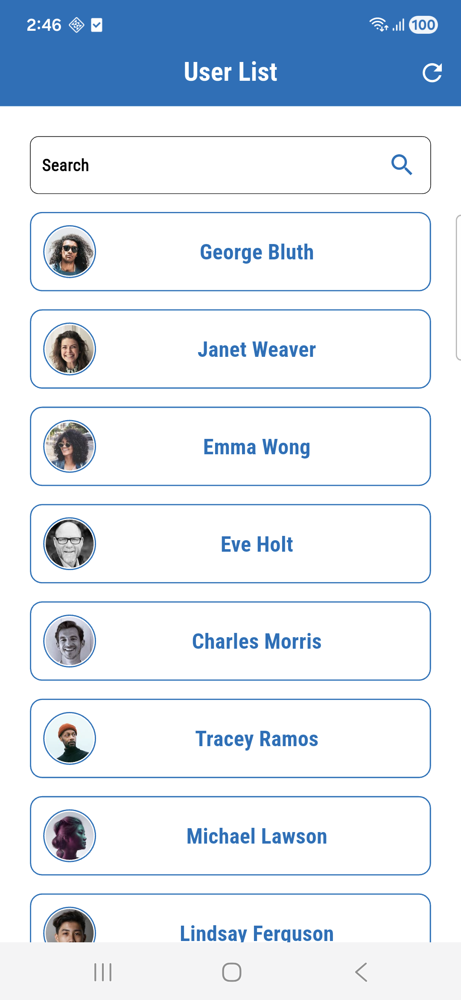
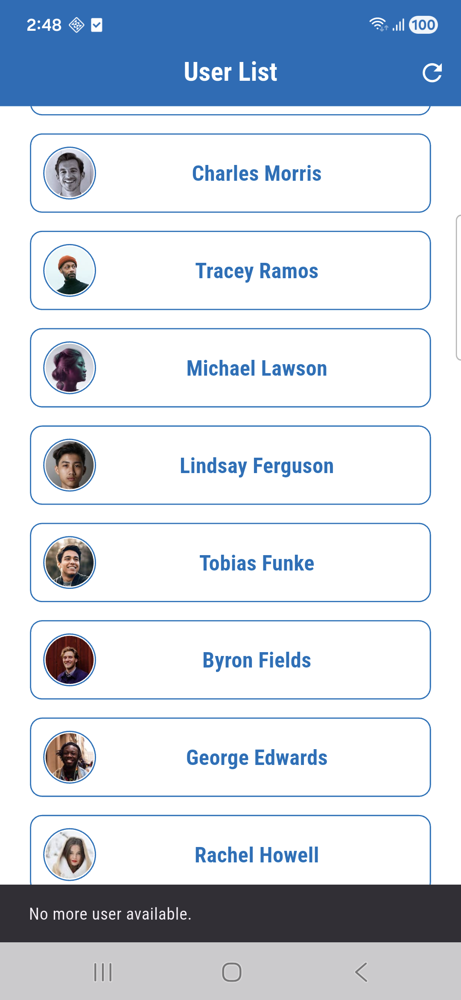
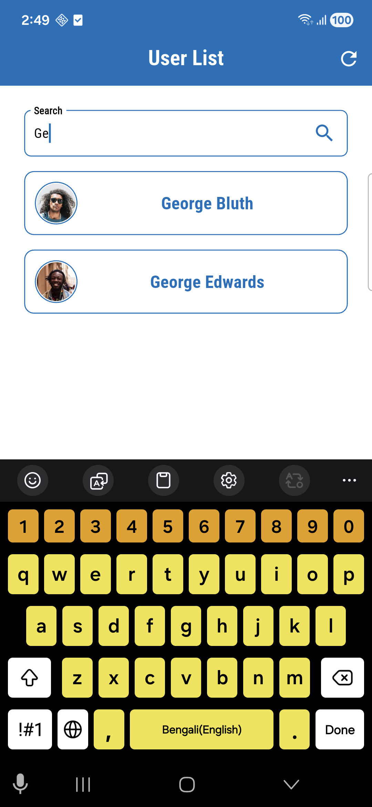
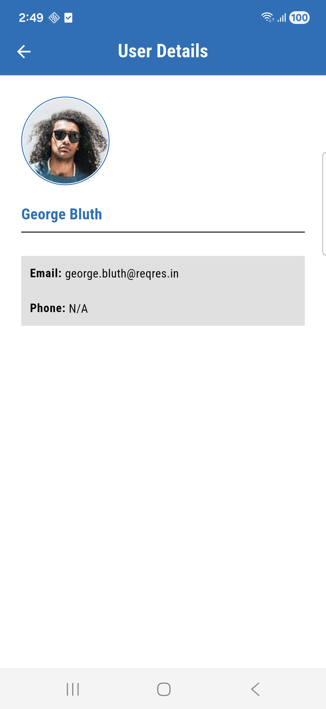
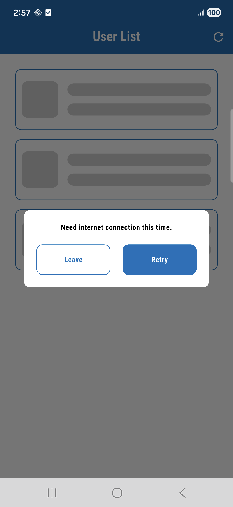
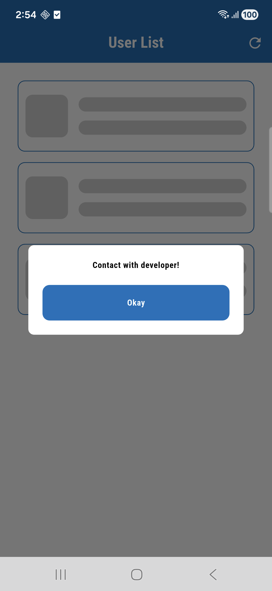
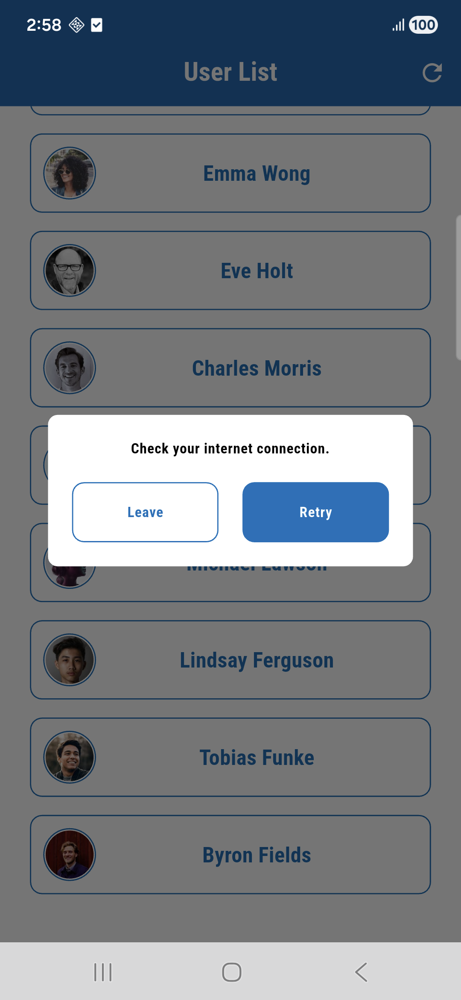

# User List App

A Flutter mobile application demonstrating Clean Architecture, BLoC state management, and an
offline-first user list experience.<br>
The app fetches users from an API, displays the list, shows user details, and supports offline
caching, lazy loading, retry options, and pull-to-refresh.

## Functional Features
- Online and offline user list
- Online and offline user details
- Lazy loading with pagination
- Pull-to-refresh
- Local search
- Retry mechanisms for network/API errors

## Non-functional Features
- BLoC pattern
- Clean Architecture
- Dependency Injection with GetIt
- Custom Dio Interceptor
- Robust error handling
- Offline cache using SharedPreferences

## Tools and technologies:

1. Framework: flutter-3.29.2
2. Programming language: dart-3.7.2

## Packages:

- state management:
    - flutter_bloc: ^9.1.1
    - bloc_concurrency: ^0.3.0
- state object's equality check:
    - equatable: ^2.0.7
- network call:
    - dio: ^5.9.0
- local storage:
    - shared_preferences: ^2.5.3
    - cached_network_image: ^3.4.1
- navigation:
    - go_router: ^17.0.0
- dependency injection:
    - get_it: ^9.0.5
- internet check:
    - connectivity_plus: ^7.0.0

## Api:

https://reqres.in/

## Installation:

To setup flutter:<br>
Follow the [official guide](https://docs.flutter.dev/get-started/install)

To run this project locally, follow these steps:

1. **Clone the repository**:

  ```bash
  git clone https://github.com/Neloy-SWE/User-List-App.git
  ```

2. **Navigate to the project directory(root folder)**:

  ```bash
  cd User-List-App
```

3. **Install dependencies**:

  ```bash
  flutter pub get
```

4. **Run test**:

  ```bash
  flutter test
```

5. **Run the application**:

  ```bash
  flutter run
```

## Project Structure:

  ```bash
├── bloc
│   └── bloc_get_user_list
│       ├── bloc_get_user_list.dart
│       ├── event_get_user_list.dart
│       └── state_get_user_list.dart
├── dependency
│   └── service_injection.dart
├── main.dart
├── network
│   ├── api
│   │   └── api_get_user_list
│   │       ├── api_call_get_user_list.dart
│   │       └── i_api_call_get_user_list.dart
│   ├── app_exception.dart
│   ├── client
│   │   ├── client.dart
│   │   ├── client_constant.dart
│   │   └── client_interceptor.dart
│   ├── connection_check
│   │   ├── connection_check.dart
│   │   └── i_connection_check.dart
│   ├── local
│   │   └── local_get_user_list
│   │       ├── i_local_get_user_list.dart
│   │       └── local_get_user_list.dart
│   ├── model
│   │   └── model_user_list.dart
│   └── repository
│       └── repository_get_user_list
│           ├── i_repository_get_user_list.dart
│           └── repository_get_user_list.dart
├── router
│   └── app_router.dart
└── view
    ├── custom_widget
    │   ├── custom_button.dart
    │   ├── custom_dialogue.dart
    │   ├── custom_profile_image_view.dart
    │   └── custom_text_form_field.dart
    ├── screen
    │   ├── screen_splash.dart
    │   ├── screen_user_details.dart
    │   └── screen_user_list.dart
    └── utility
        ├── app_color.dart
        ├── app_font.dart
        ├── app_size.dart
        ├── app_text.dart
        └── app_theme.dart
```

## Overview:

<p float="left">
  

- splash screen.

<br>
<p float="left">
  
  
  
  

- client can see user list here.
- for the first time client need to connect internet for proper synchronization.
- client may finds pull to refresh, retry options.
- if full list loaded, client may sees the message.
- client may uses search function as well as.

<br>
<p float="left">
  

- User details screen.

<br>
<p float="left">
  
  
  

- without internet for the first time, client will only have retry options.
- if there any problem from api end. client will have information about to communicate with
  developer.
- client may sees some initial users with details, but cannot use lazy loading.

## Future scopes:

1. More user details add at api end such as phone number, location, etc.
2. Add “Report Problem” option for clients.
3. Role based authentication.
4. add, update, delete option of users.
5. add more users for better visualization of lazy loading.
6. add dedicated search api by username.

### Contact:

For further implementation feel free to reach out at: taufiqneloy.swe@gmail.com